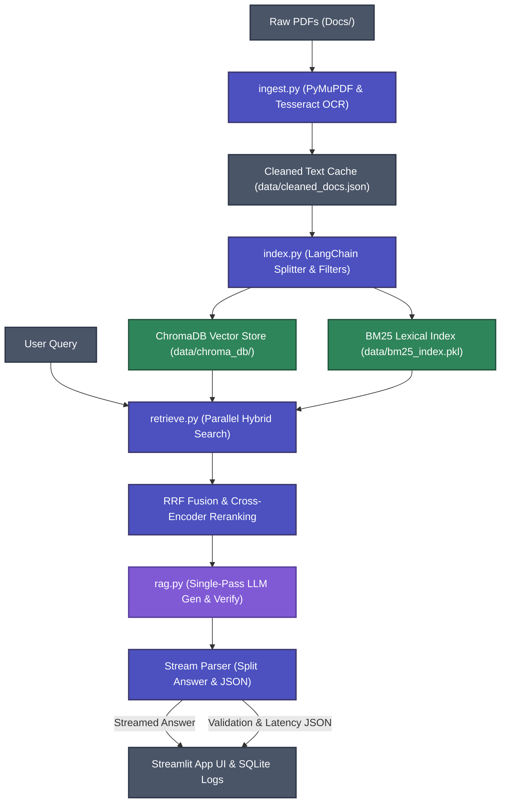

# DocuMind: RAG Pipeline & Data Flow Architecture

This document provides a detailed breakdown of the end-to-end architecture, pipeline stages, and sequential data flows within the DocuMind RAG system.

---

## 📊 End-to-End Data Flow

The diagram below illustrates how raw PDF documents are processed, indexed, queried, and verified to return low-latency, hallucination-free answers:

---

## ⚙️ Stage-by-Stage Pipeline Detail

### Stage 1: Document Ingestion (`src/ingest.py`)
Extracts raw text from PDF files and normalizes it.

1. **Native Text Extraction**: Attempts to extract native text using **PyMuPDF (`fitz`)**, which is highly efficient.
2. **OCR Fallback**: If a page yields fewer than 100 characters (typically scanned documents or images), it renders the page image at 150 DPI and executes **Tesseract OCR (`pytesseract`)**.
3. **Text Cleaning**: Normalizes ligatures (e.g. `fi` $\rightarrow$ `fi`), removes headers/footers, and strips trailing page numbers.
4. **Caching**: Writes the page-by-page cleaned text to [data/cleaned_docs.json](file:///c:/Users/rajpu/OneDrive/Desktop/hackathon_rag_bot/data/cleaned_docs.json). This serves as a rapid ingestion cache so subsequent system starts don't re-run expensive OCR steps.

---

### Stage 2: Indexing & Vectorization (`src/index.py`)
Segments cached text and builds dense vector and sparse lexical search indices.

1. **Chunking**: Chunks text from the JSON cache using LangChain's `RecursiveCharacterTextSplitter` with `chunk_size=600` characters and `chunk_overlap=120` characters.
2. **Quality Filtering**:
   - Prunes short chunks (<50 characters).
   - Filters out noisy OCR artifacts using custom heuristics:
     - **Letter Density**: Requires at least 40% of characters to be alphabetic.
     - **Vowel Ratio**: Requires at least 15% of alphabetical characters to be vowels.
     - **Noise Sequences**: Rejects chunks with excessive repetitive symbols (e.g., `---`, `___`, `***`).
3. **Dense Vector Indexing**:
   - Generates 384-dimensional dense embeddings using local PyTorch CPU execution of the **`all-MiniLM-L6-v2`** SentenceTransformer model.
   - Inserts chunks and vectors into a persistent **ChromaDB** collection with Cosine Similarity spacing configuration.
4. **Sparse Lexical Indexing**:
   - Tokenizes and normalizes the same text chunks.
   - Builds a **BM25 index (`BM25Okapi`)** and serializes the index state and chunk lookups to [data/bm25_index.pkl](file:///c:/Users/rajpu/OneDrive/Desktop/hackathon_rag_bot/data/bm25_index.pkl).

---

### Stage 3: Parallel Hybrid Retrieval & Fusion (`src/retrieve.py`)
Combines semantic search and keyword search to retrieve the most relevant passages.

1. **Query Embedding**: The incoming query string is embedded (cached via `@lru_cache` for quick subsequent lookup).
2. **Parallel Retrieval**: Executes vector search on ChromaDB and sparse lexical search on BM25 concurrently using a `ThreadPoolExecutor` (reducing I/O and query overhead).
3. **Reciprocal Rank Fusion (RRF)**: Merges the independent rankings from both search components.
   $$RRF(d) = \frac{1}{60 + r_{vector}(d)} + \frac{1}{60 + r_{bm25}(d)}$$
   The top 10 candidates are passed to the reranking stage.

---

### Stage 4: Cross-Encoder Reranking (`src/retrieve.py`)
Refines the candidate pool using a local relevance ranking model.

1. **Relevance Scoring**: Evaluates the query against each candidate passage using the highly efficient 2-layer **`ms-marco-MiniLM-L-2-v2`** CrossEncoder model.
2. **Threshold Filtering**: Discards any passage with a reranker score lower than `-2.0`.
3. **Adaptive Context Pruning**: If the top chunk matches the query exceptionally well (reranker score $> 4.0$), the system prunes subsequent passages that are more than 3.5 points below the top score to keep the context input compact and avoid noise.

---

### Stage 5: Streaming Generation & Fact Verification (`src/rag.py`)
Queries the LLM and executes real-time response parsing and validation.

1. **Combined Prompt Strategy**: Constructs a prompt containing the retrieved context passages and forces the LLM (**Gemini 2.5 Flash**) to output the answer, cited sources, and a structured fact validation JSON block (containing verification status, confidence score, and justification) in a single pass.
2. **Stream Parser**: Iterates through the streaming response tokens:
   - Tokens belonging to the answer are streamed directly to the Streamlit UI with **zero perceived latency** (typically in ~1s).
   - Once a `[VALIDATION]` tag is encountered, subsequent tokens are diverted to a background buffer to accumulate the JSON fact-check block.
3. **Safety Fallbacks**:
   - If the verification status is returned as `UNSUPPORTED`, the UI overrides the response and displays: *"Information not found in documents."*
   - If a Gemini API rate limit occurs, the status becomes `API_ERROR` and a warning is printed to allow user key configuration.

---

### Stage 6: UI Rendering & SQLite Performance Logging (`app.py`)
Displays metrics to the user and tracks RAG health analytics.

1. **User Presentation**: Renders the streamed answer, formatted cited sources (including source text, page numbers, and search scores), and the overall confidence score.
2. **Metrics Persistence**: Inserts query text, response, status, latencies (retrieval, reranking, generation, and total), and confidence parameters into the local SQLite database [data/monitoring.db](file:///c:/Users/rajpu/OneDrive/Desktop/hackathon_rag_bot/data/monitoring.db).
3. **Analytics Dashboard**: Reads SQLite records to render real-time charts (P95 latency, average confidence score, and hallucination rates) in the monitoring dashboard tab.
